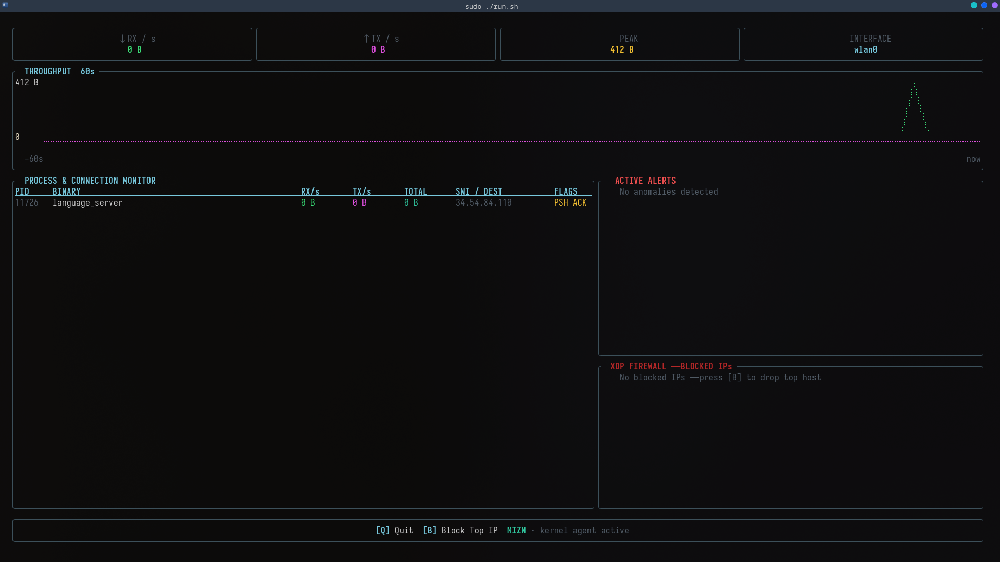

```
░█▄█░▀█▀░▀▀█░█▀█
░█░█░░█░░▄▀░░█░█
░▀░▀░▀▀▀░▀▀▀░▀░▀
```

<p align="center">
  
</p>

<p align="center">
  <b>Real-time network monitor that lives inside your kernel.</b><br/>
  <i>eBPF / XDP / Ratatui / Rust / Zero-Copy / IPv6 / ICMP / SNI / SQLite / Webhooks</i>
</p>

<p align="center">
  
  
  
  
  
</p>

---

## Overview

MIZN is a kernel-level network monitoring platform written in Rust. By hooking directly into the Linux networking stack at the XDP (eXpress Data Path) layer, it intercepts and analyzes packets right at the network card driver—before the kernel even allocates memory for them. This creates a zero-copy data path for unparalleled efficiency. A lightweight userspace daemon asynchronously reads eBPF maps, resolves socket-to-process ownership, logs telemetry to SQLite, and streams the metrics to a btop-inspired terminal dashboard. MIZN also features a dedicated headless alerting engine capable of dispatching anomaly notifications (via Webhooks and SMTP) independently of the UI.

---

## Features

- **XDP-level packet interception** — captures traffic before the kernel networking stack processes it
- **IPv4 & IPv6 parsing** — full dual-stack support; IPv6 XDP blocklist enforced
- **ICMP / ICMPv6 visibility** — tracks ping, traceroute, and `ping death` attack patterns
- **Per-process bandwidth tracking** — maps network flows to PIDs via procfs
- **TLS SNI extraction** — reads the plaintext Server Name Indication field from TLS Client Hello messages
- **TCP and UDP flow tracking** — Protocol 6 (TCP) and Protocol 17 (UDP)
- **XDP Firewall / IPS** — dynamically blocks source IPs (v4 and v6) at the driver level via BPF hash maps and `XDP_DROP`
- **TCP anomaly detection** — flags SYN-without-ACK patterns (port scans)
- **SQLite telemetry persistence** — WAL-mode SQLite replaces CSV; indexed by timestamp, PID, and process name
- **Headless alerting engine** — rules-based monitor in `miznd`; fires even when TUI is closed
  - Webhook integration (Slack / Discord JSON POST) via `MIZN_WEBHOOK_URL`
  - SMTP email dispatch for urgent security alerts
- **Process watchlist** — pins critical processes (`sshd`, `nginx`) to the top of the dashboard
- **Zero-copy data path** — kernel maps → daemon → TUI with no unnecessary allocations
- **btop-style terminal dashboard** — Braille graphs, rounded borders, modular panels, live security alerts

---

## Dashboard Layout

<p align="center">
  
</p>

**Panels:**

| Panel | Purpose |
|-------|---------|
| Header | Live RX/TX rates, peak throughput, active network interface |
| Throughput Graph | 60-second Braille chart with dual RX/TX datasets |
| Process Table | Per-process PID, binary name, RX, TX, total, SNI/destination, TCP flags |
| Active Alerts | Scrolling list of detected anomalies (SYN scans, high bandwidth spikes) |
| XDP Firewall | List of IPs currently blocked at the driver level |

---

## Architecture

```
+--------------------------------------------------+
|                  Linux Kernel                    |
|  +--------------------------------------------+  |
|  |  mizn-ebpf  (eBPF/XDP program)             |  |
|  |  - hooks at NIC driver level               |  |
|  |  - parses Ethernet > IPv4 / IPv6           |  |
|  |  - handles TCP, UDP, ICMP, ICMPv6          |  |
|  |  - writes to FLOW_METRICS map              |  |
|  |  - enforces BLOCKLIST + BLOCKLIST_V6       |  |
|  +---------------------+----------------------+  |
+-----------------------|--------------------------+
                        | aya (reads BPF maps)
              +---------v-----------+
              |       miznd         |
              |  userspace daemon   |
              |  - resolves PIDs    |
              |  - SQLite WAL log   |
              |  - alerting engine  |
              |  - webhook / SMTP   |
              |  - manages blocklist|
              +---------+-----------+
                        | /run/miznd.sock (telemetry)
                        | /run/miznd_cmd.sock (commands)
              +---------v----------+
              |      mizn-ui       |
              |  ratatui terminal  |
              |  btop-style layout |
              +--------------------+
```

### mizn-ebpf

XDP program compiled for the BPF VM using `cargo +nightly` with `build-std=core`. Runs at the NIC driver level. Parses Ethernet, IPv4, **IPv6**, TCP, UDP, **ICMP, and ICMPv6** headers. Builds flow keys, extracts SNI from TLS Client Hello messages, and enforces `BLOCKLIST` maps by returning `XDP_DROP` for matched source addresses.

### miznd

The userspace daemon. It leverages the `aya` crate to read eBPF maps, dynamically resolves socket-to-PID mappings via `/proc`, and reliably persists historical traffic flows to a SQLite database (`miznd_telemetry.db`) using Write-Ahead Logging. Furthermore, it manages a Unix socket (`/run/miznd_cmd.sock`) to execute dynamic IP blocking commands. A core component of `miznd` is its headless alerting engine, which asynchronously evaluates traffic states to dispatch webhook and SMTP alerts for security anomalies. The daemon continuously streams serialized telemetry snapshots via `rkyv` to the UI dashboard over `/run/miznd.sock`.

### miznd/src/telemetry.rs

SQLite persistence module. Opens or creates `miznd_telemetry.db`, enables WAL mode for crash safety, and exposes `record_flow()` for writing per-flow events. Schema: `flow_events(id, ts, pid, process, bytes_delta, sni, protocol)`.

### miznd/src/alerting.rs

Headless rules engine. Runs as a Tokio task, receives each `IpcState` tick, and evaluates:
1. **Port scan** — SYN-without-ACK pattern
2. **High-bandwidth burst** — configurable threshold (default 100 MB/s per process)
3. **Global throughput spike** — 3× threshold

Dispatches JSON webhooks (Slack / Discord) and SMTP email on trigger.

### mizn-ui

Terminal dashboard built with `ratatui`. Four-panel btop-style layout with a header stats row, 60-second Braille throughput chart, annotated process/connection table (SNI, TCP flags, watchlist markers), and a live security panel showing active alerts and blocked IPs.

### mizn-common

Shared types: `FlowKey`, `FlowMetrics`, `IpcState`, `IpcProcessMetrics`, `IpcCommand`.

---

## Warning

**This is alpha software. Do not run this on a production machine.**

This tool injects eBPF bytecode into the kernel's critical networking path. Incorrect behaviour can cause kernel panics and system crashes.

Requirements:
- Root privileges (or `CAP_BPF` + `CAP_NET_ADMIN`)
- Linux only (tested on kernel 5.15+)
- Will not work on WSL or VMs without NIC passthrough
- Falls back to XDP SKB mode if native mode is not supported

---

## Getting Started

### Prerequisites

```bash
# Rust nightly toolchain with BPF target
rustup install nightly
rustup target add bpfel-unknown-none
rustup component add rust-src --toolchain nightly

# Debian / Ubuntu
sudo apt install linux-headers-$(uname -r) clang llvm libelf-dev
# Optional: bpftool for BTF inspection and debugging
sudo apt install linux-tools-$(uname -r)

# Arch Linux
sudo pacman -S linux-headers clang llvm libelf
# Optional: bpftool for BTF inspection and debugging
sudo pacman -S bpftool
```

### Clone

```bash
git clone https://github.com/arif39x/MIZN.git
cd MIZN
```

### Build and Run

```bash
sudo ./run.sh
```

The script checks dependencies, builds the eBPF object and all userspace binaries, then starts the daemon and launches the dashboard.

**Force a specific network interface:**

```bash
sudo MIZN_IFACE=eth0 ./run.sh
```

**Enable Slack / Discord webhook alerting:**

```bash
sudo MIZN_WEBHOOK_URL="https://hooks.slack.com/services/..." ./run.sh
```

On-demand PCAP captures are written to `/var/lib/mizn/pcap/` (created automatically).

### Querying Telemetry

```bash
# View most recent 100 flow events
sqlite3 miznd_telemetry.db \
  "SELECT ts, pid, process, bytes_delta, sni, protocol FROM flow_events ORDER BY id DESC LIMIT 100;"

# Aggregate bytes per process in the last hour
sqlite3 miznd_telemetry.db \
  "SELECT process, SUM(bytes_delta) as total FROM flow_events
   WHERE ts > strftime('%s','now','-1 hour') GROUP BY process ORDER BY total DESC;"
```

### Keybindings

| Key | Action |
|-----|--------|
| `q` / `Esc` | Exit |
| `b` | Block the top bandwidth-consuming IP via XDP |

---

## Project Structure

```
MIZN/
├── mizn-ebpf/         # eBPF/XDP kernel program (Rust, no_std)
│   ├── src/maps.rs      BPF Maps (FLOW_METRICS, BLOCKLIST)
│   ├── src/headers.rs   Network protocol zero-copy struct definitions
│   ├── src/metrics.rs   Bandwidth aggregation & SNI extraction
│   └── src/parsing/     Modular parsers (mod, ipv4, ipv6, transport)
├── miznd/             # Userspace daemon
│   ├── src/main.rs      Core initialisation & XDP attachment
│   ├── src/core_loop.rs High-performance flow aggregation & IPC streaming
│   ├── src/bpf_loader.rs aya abstraction for eBPF hooks
│   ├── src/telemetry.rs SQLite WAL persistence
│   ├── src/pcap_writer.rs On-demand raw .pcap generation
│   ├── src/alerting/    Headless rules engine & webhook/SMTP dispatch
│   └── src/clickhouse/  Native ClickHouse streaming integration
├── mizn-ui/           # Terminal dashboard (ratatui)
│   ├── src/main.rs      Main event loop & state ownership
│   └── src/draw/        Modular rendering (header, graph, table, security)
├── mizn-common/       # Shared types
│   └── src/             bpf.rs, ipc.rs (Zero-copy IPC definitions)
├── xtask/             # Build orchestrator
├── asset/             # Logo and screenshots
├── run.sh             # One-shot build and launch script
└── .gitignore
```

---

## Roadmap

- [x] XDP-level packet capture and flow tracking (TCP + UDP)
- [x] TLS SNI extraction from HTTPS traffic
- [x] TCP anomaly detection (SYN scans, flag analysis)
- [x] XDP Firewall — dynamic IP blocking at driver level
- [x] btop-style terminal UI with live Braille graphs
- [x] IPv6 parsing and dual-stack blocklist
- [x] ICMP / ICMPv6 visibility
- [x] SQLite WAL telemetry persistence
- [x] Headless alerting engine (webhook + SMTP)
- [x] On-demand PCAP capture (perf_event_array → `.pcap`)
- [ ] Event-driven PID mapping via kprobes / tracepoints (eliminate polling race)
- [ ] CO-RE / BTF compilation (`build-std` + vmlinux.h) for cross-kernel portability

---

## Contributing

If you know eBPF or Rust kernel internals, issues and pull requests are welcome.

1. Fork the repository
2. Create a feature branch (`git checkout -b feat/your-thing`)
3. Verify the build locally (`cargo run --package xtask -- build`)
4. Open a pull request with a description of what changed and why

When reporting bugs, include:
- Kernel version (`uname -r`)
- NIC type and driver
- Full error output

---

## Contact

**Sk Arif Ali**

- GitHub: [@arif39x](https://github.com/arif39x)
- Email: [aliarif1168@gmail.com](mailto:aliarif1168@gmail.com)

---

<p align="center">
  <sub>Built with too much caffeine and an unhealthy obsession with kernel internals.</sub>
</p>

---
